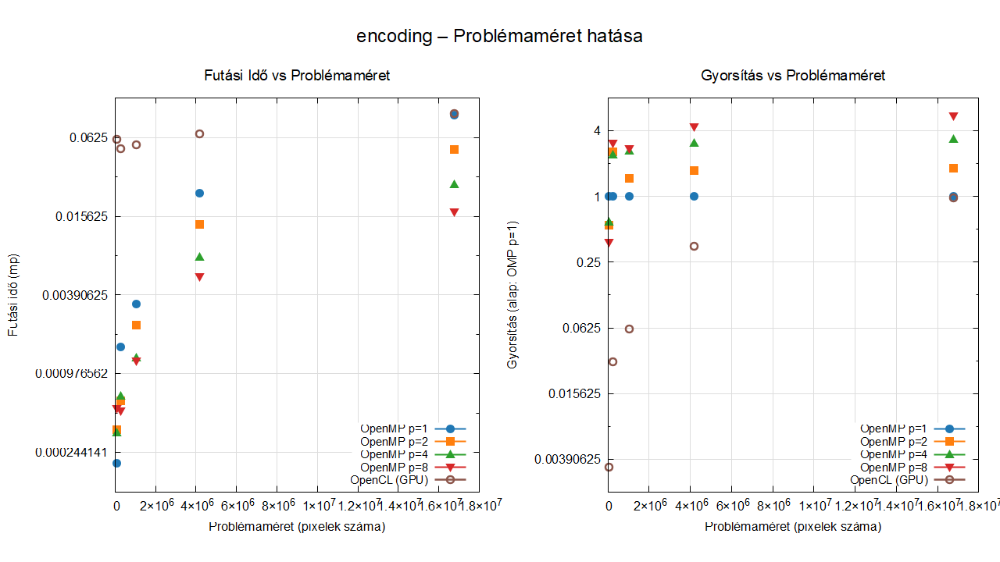
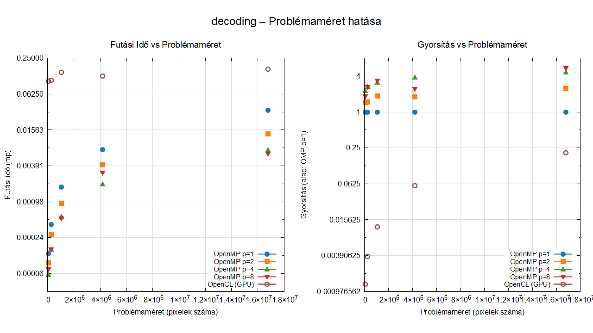
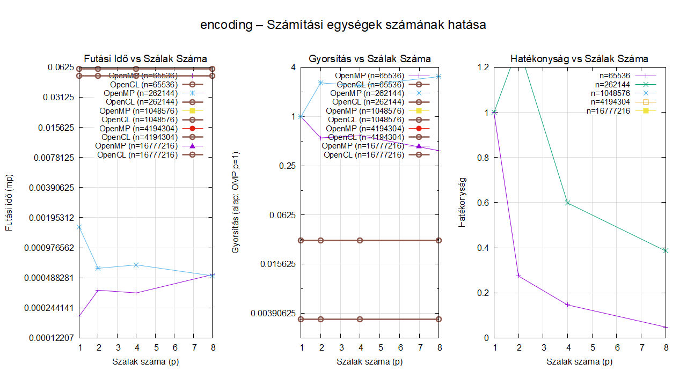
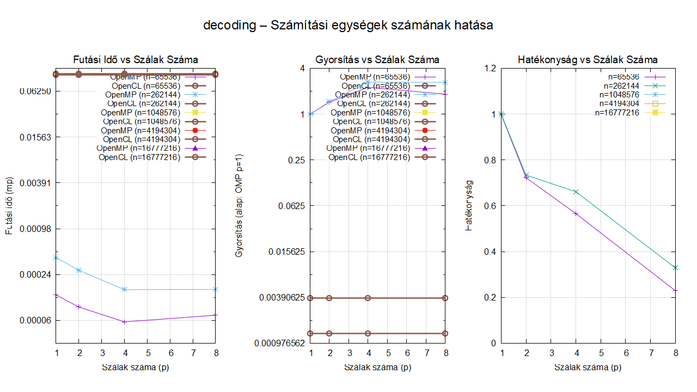

# Párhuzamos LSB Szteganográfia – OpenMP és OpenCL összehasonlítás

**Párhuzamos eszközök programozása**

---

## Specifikáció

### A feladat

A program LSB (Least Significant Bit) szteganográfiát valósít meg: egy titkos üzenetet
egy hordozó PPM képfájlba rejt el, majd onnan visszafejti. A módszer lényege, hogy
minden hordozó bájt (R/G/B csatornaérték) legkisebb értékű bitjét egyetlen hasznos
payload-bittel felülírja. Az emberi szem az így keletkező ~0,4%-os fényességváltozást
nem érzékeli.

### Miért alkalmas párhuzamosításra?

A kódolás és dekódolás tökéletesen adatpárhuzamos:

- **Kódoláskor** az i-edik hordozó bájt csak az i-edik payload-bittől függ.  
  Nincs adatfüggőség szomszédos elemek között → nincs szükség szinkronizációra.
- **Dekódoláskor** az i-edik kimenet-bájt csak a `[8i, 8i+7]` indexű hordozó
  bájtokból épül fel → szintén független minden más kimenettől.

### Megvalósítás

| Réteg | Technológia | Párhuzamos egység |
|---|---|---|
| CPU | OpenMP `parallel for` | szálak (p = 1…N) |
| GPU | OpenCL NDRange kernel | work-item-ek (globális méret = payload bitek száma) |

**Hordozó képformátum:** bináris PPM vagy PNG.

---

## Könyvtárstruktúra

```
beadando/
├── data/
│   ├── demo/             # Demo futtatásakor létrejövő mappa
│   ├── docs/             # Statikus mérési eredmények dokumentációhoz
│   ├── results/          # CSV mérési eredmények
│   ├── plots/            # Gnuplot által generált PNG ábrák
│   ├── samples/          # Program által kezelt források
│      ├── inputs/        # input.png  input.ppm  input.txt
│      ├── outputs/       # Opcionális kimeneti mappa
│   ├── plot_n.plt        # Gnuplot: futási idő / gyorsítás vs problémaméret
│   └── plot_p.plt        # Gnuplot: futási idő / gyorsítás / hatékonyság vs problémaméret
├── kernels/
│   └── steganography.cl  # OpenCL kernelek (encode_kernel, decode_kernel)
├── include/
│   ├── common/           # benchmark.h filesystem_utils.h  image_io.h  stego_types.h  stego_utils.h
│   ├── openmp/           # stego_openmp.h
│   └── opencl/           # stego_opencl.h  run_cl.h  kernel_loader.h
│   └── stb/              # stb lib headerjei PNG kezeléshez
├── src/
│   ├── common/           # benchmark.c  filesystem_utils.c  image_io.c  stb_impl.c  stego_utils.c  
│   ├── openmp/           # stego_openmp.c
│   └── opencl/           # stego_opencl.c  run_cl.c  kernel_loader.c
├── demo.bat              # Program demo parancsok (windows)
├── main.c
└── Makefile
```

---

## Fordítás

**Előfeltételek:**
- GCC ≥ 9 (`-fopenmp` támogatással)
- OpenCL fejlesztői csomag (pl. `ocl-icd-opencl-dev` Debian/Ubuntu alatt)
- `gnuplot` (csak benchmarkoláshoz)

```bash
make          # fordítás + könyvtárak létrehozása
make gen      # teszt hordozó kép generálása (1024×1024)
make bench    # teljes benchmark futtatása alapértelmezett méretekkel
make clean    # bináris és adatfájlok törlése
```

---

## Használat

### Kép generálása (benchmark hordozónak)
```bash
./stego gen <szélesség> <magasság> <kimenet.ppm>
# Példa:
./stego gen 2048 2048 data/samples/carrier.ppm
```

### Kódolás
```bash
./stego encode <hordozo.ppm> <kimenet.ppm> <uzenet.txt> [--omp|--ocl] [--threads N]
# Példák:
./stego encode carrier.ppm stego.ppm secret.txt --omp --threads 4
./stego encode carrier.ppm stego.ppm secret.txt --ocl
```

### Dekódolás
```bash
./stego decode <stego.ppm> <kimenet.txt> [--omp|--ocl] [--threads N]
# Példák:
./stego decode stego.ppm recovered.txt --omp --threads 4
./stego decode stego.ppm recovered.txt --ocl
```

### Benchmark futtatása
```bash
./stego bench [n=<méret>...] [p=<szál>...] [t=<próba>] [-noplot]
# Példák:
./stego bench                                    # alapértelmezett beállítások
./stego bench n=256 512 1024 2048 p=1 2 4 8     # egyedi méret/szál értékek
./stego bench n=1024 p=4 t=5 -noplot            # gnuplot nélkül, 5 próba
```

---

## Mérések

A benchmark futtatásakor az alábbi fájlok automatikusan létrejönnek vagy módosulnak. Az eredeti fájlok megtalálhatók a `data/docs` mappában.

### CSV formátum (`data/results/performance.csv`)

| Oszlop | Tartalom |
|---|---|
| `n` | Képméret (pixelek száma = szélesség²) |
| `p` | OpenMP szálak száma |
| `omp_encode` | OMP kódolási idő (mp) |
| `ocl_encode` | OCL kódolási idő (mp) |
| `omp_decode` | OMP dekódolási idő (mp) |
| `ocl_decode` | OCL dekódolási idő (mp) |
| `S_omp_encode` | OMP gyorsítás (alap: p=1) |
| `E_omp_encode` | OMP hatékonyság |
| `S_ocl_encode` | OCL gyorsítás az OMP p=1 alaphoz képest |
| `S_omp_decode` | (dekódolás, ua.) |
| `E_omp_decode` | (dekódolás, ua.) |
| `S_ocl_decode` | (dekódolás, ua.) |

### Ábrák (`data/plots/`)

| Fájl | Tartalom |
|---|---|
| `encoding_n.png` | **Kódolási** futási idő és gyorsítás vs problémaméret |
| `encoding_p.png` | **Kódolási** idő, gyorsítás, hatékonyság vs szálszám |
| `decoding_n.png` | **Dekódolási** futási idő és gyorsítás vs problémaméret |
| `decoding_p.png` | **Dekódolási** idő, gyorsítás, hatékonyság vs szálszám |

Minden ábra az OpenMP görbéket szálszám szerint, az OpenCL eredményt pedig
egyetlen referenciavonalként mutatja (a GPU szálszámát nem a felhasználó
szabályozza).

#### Kódolás problémaméret hatása


#### Dekódolás problémaméret hatása


#### Kódolás számítási egységek számának hatása


#### Dekódolás számítási egységek számának hatása

